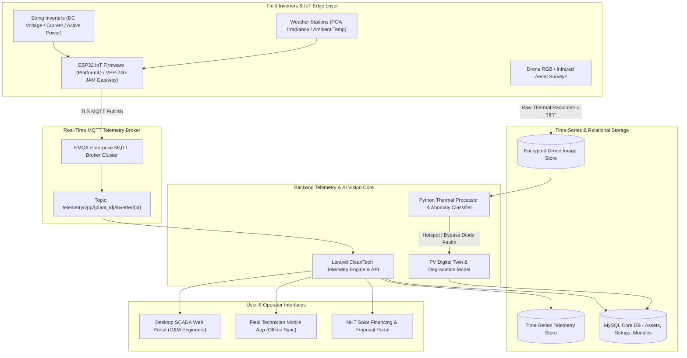
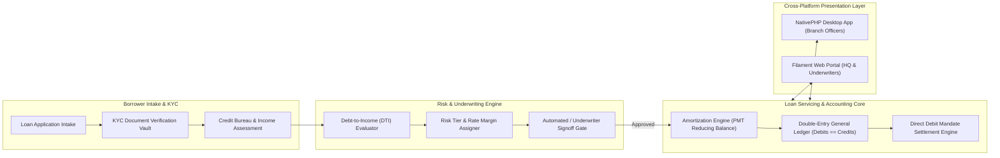
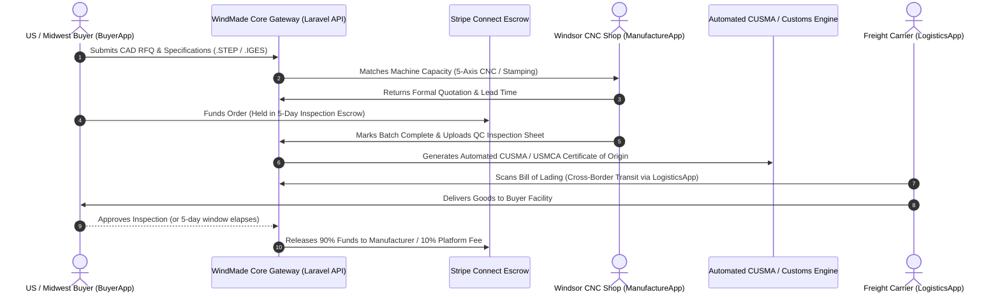
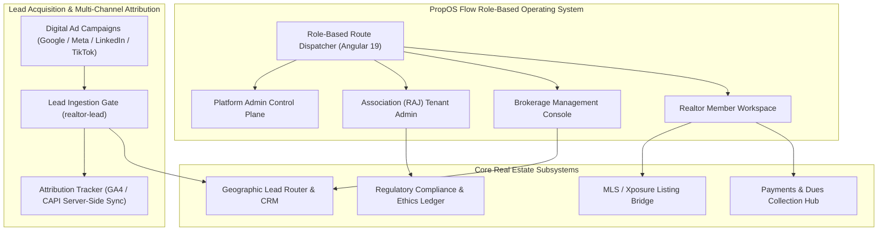
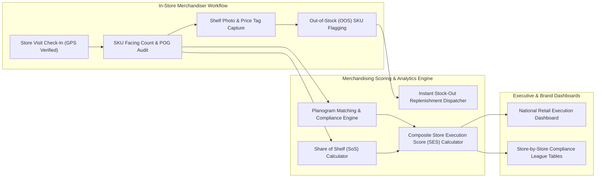
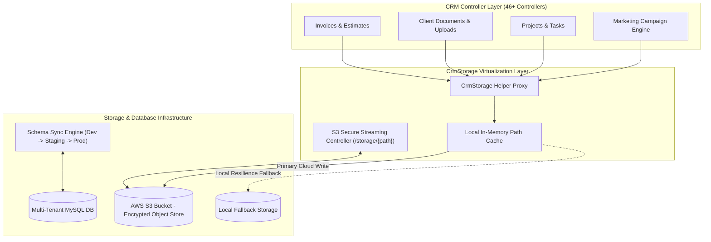
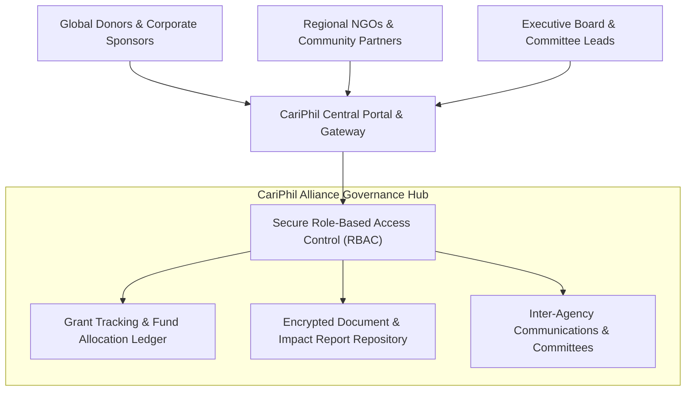
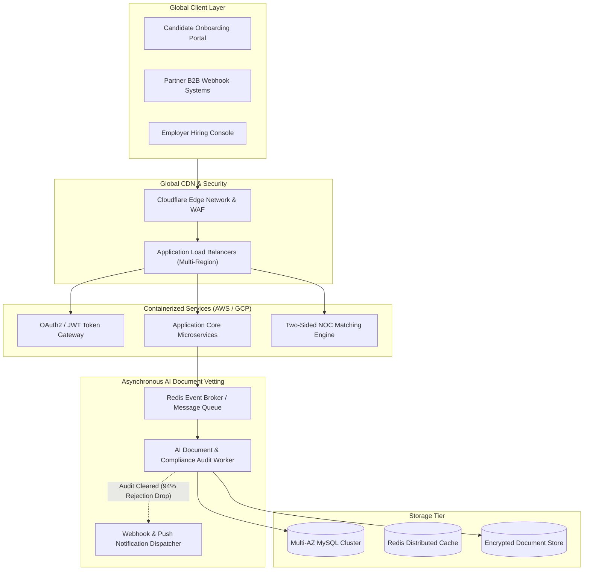
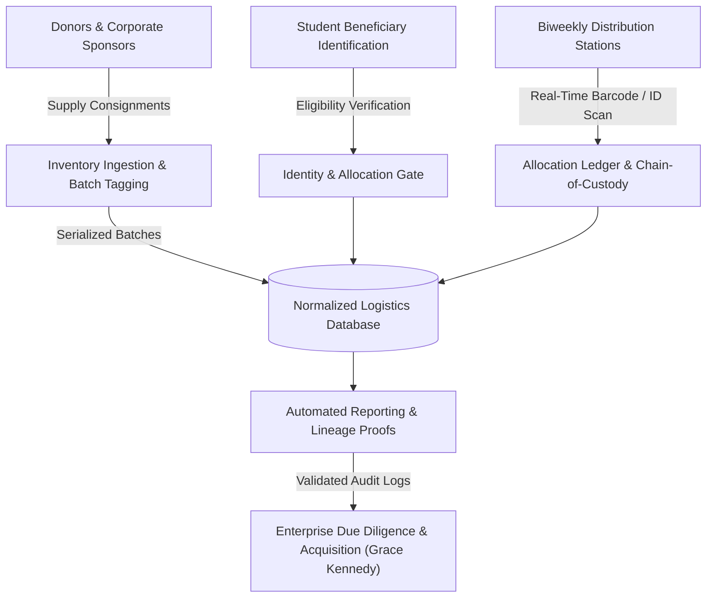

<div align="center">

# Norval Mendez | Systems Architecture & Engineering Portfolio

**Senior Software Developer & Lead Systems Architect**  
*Windsor, ON, Canada • [LinkedIn](https://www.linkedin.com/in/norval-mendez-369a2611a) • [Portfolio](https://norvalmendez.ca) • [Email](mailto:norvalmendez.ca@gmail.com)*

[](https://github.com/norval101)
[](https://www.linkedin.com/in/norval-mendez-369a2611a)
[](https://norvalmendez.ca)
[](https://github.com/norval101/portfolio-demos)
[](https://github.com/norval101/portfolio-demos#-system-architecture-gallery)
[](https://opensource.org/licenses/MIT)

<p align="center">
  <b>High-Availability Cloud Systems • IoT SCADA & CleanTech • FinTech Double-Entry Ledgers • B2B Industrial Marketplaces • PropTech OS • AI Automated Audit Pipelines</b>
</p>

---

</div>

## 📌 Executive Summary & Architecture Showcase

I am an award-winning **Senior Software Developer & Systems Architect** with 8+ years of engineering leadership, designing mission-critical SaaS platforms, IoT edge telemetry grids, distributed FinTech ledgers, and multi-region cloud infrastructures across Canada and the Caribbean.

Throughout my career, I have:
- **Architected high-availability cloud platforms for 8,000+ global users**, sustaining 99.9% uptime and driving 400% YoY enterprise revenue growth.
- **Engineered CleanTech IoT & Digital Twin Grids**, streaming real-time string inverter telemetry via EMQX MQTT brokers and implementing computer-vision thermal defect detection for photovoltaic plants.
- **Constructed Banking & FinTech Underwriting Engines**, executing actuarial loan amortization schedules and strict double-entry general ledger balance invariants.
- **Pioneered automated AI vetting & audit pipelines**, slashing cross-border applicant processing rejection rates by **94%**.
- **Delivered Acquisition-Proven Systems**, including the core distribution logistics platform for *GK Campus Connect*, directly prompting enterprise acquisition by the **Grace Kennedy Group**.

---

## 🔒 Confidentiality & NDA Provenance Notice

> **Why are production client repositories private?**  
> Many of the platforms detailed below process proprietary enterprise data, cross-border workforce credentials, commercial manufacturing CAD files, or regulated banking/financial ledgers protected under strict **Non-Disclosure Agreements (NDAs)**.
>
> To respect client confidentiality while providing hiring managers, CTOs, and technical interviewers with complete visibility into my architectural thinking, this repository provides:
> 1. **Production System Architecture Blueprints** (rendered via Mermaid.js directly in GitHub markdown).
> 2. **Technical Specifications & Problem-Solving Deconstructions** (trade-offs, bottlenecks, data flow, security governance, and state machines).
> 3. **Public Sandbox Code Implementations** (five clean, self-contained reference sandboxes with **100% unit test coverage** demonstrating my production coding standards).

---

## 🧭 Architecture Showcase Navigation

- [1. CleanTech & IoT Digital Twin Platform (`solar-engineering` & `nht-solar`)](#1-cleantech--iot-digital-twin-platform-solar-engineering--nht-solar)
- [2. FinTech Loan Underwriting & Double-Entry Ledger (`loan-managment-software`)](#2-fintech-loan-underwriting--double-entry-ledger-loan-managment-software)
- [3. Industrial B2B Marketplace & Cross-Border Supply Chain (`WindMade.ca`)](#3-industrial-b2b-marketplace--cross-border-supply-chain-windmadeca)
- [4. PropTech & Regulatory Real Estate Operating System (`propOSFlow` & `realtor-lead`)](#4-proptech--regulatory-real-estate-operating-system-proposflow--realtor-lead)
- [5. Retail Merchandising, Field Auditing & POS Compliance (`mechandizing-software`)](#5-retail-merchandising-field-auditing--pos-compliance-mechandizing-software)
- [6. Enterprise Multi-Tenant CRM, Storage Abstraction & S3 Engine (`client-crm`)](#6-enterprise-multi-tenant-crm-storage-abstraction--s3-engine-client-crm)
- [7. Pan-Caribbean Philanthropic Governance & Coalition Portal (`cariphil`)](#7-pan-caribbean-philanthropic-governance--coalition-portal-cariphil)
- [8. Global Workforce Mobility SaaS & AI Document Vetting (`WATSOF` & `LMIAPro`)](#8-global-workforce-mobility-saas--ai-document-vetting-watsof--lmiapro)
- [9. Distribution Logistics Infrastructure (`GK Campus Connect` — Acquired by Grace Kennedy Group)](#9-distribution-logistics-infrastructure-gk-campus-connect--acquired-by-grace-kennedy-group)
- [📁 Five Functional Reference Sandboxes (Included in this Repo)](#-five-functional-reference-sandboxes-included-in-this-repo)

---

## 🗺️ System Architecture Gallery

### 1. CleanTech & IoT Digital Twin Platform (`solar-engineering` & `nht-solar`)
**Domain:** IoT SCADA Telemetry, Photovoltaic Digital Twin & Clean Energy Financing  
**Tech:** ESP32 PlatformIO C++, EMQX MQTT Broker, Python Thermal Vision Processor, Laravel Core API, MySQL, TimescaleDB

#### Business Context & Challenge
Large-scale commercial and residential solar installations suffer from undetected string dropouts, panel micro-cracks, and thermal hotspots that degrade annual energy yield by up to 25%. Traditional inspections rely on manual thermography with high labor costs and zero historical traceability.

#### Architectural Solution
- Built an edge-to-cloud IoT telemetry pipeline: ESP32 microcontrollers ingest real-time inverter voltage, current, and irradiance telemetry, publishing to an **EMQX MQTT broker**.
- Implemented an asynchronous **Thermal Computer Vision Processor** that analyzes aerial drone infrared imagery, geolocating defective PV modules down to string and table coordinates.
- Integrated a government financing calculation engine (`nht-solar`) providing automated yield estimations, ROI payback projections, and customer quotation proposals.



---

### 2. FinTech Loan Underwriting & Double-Entry Ledger (`loan-managment-software`)
**Domain:** Enterprise Credit Underwriting, Loan Servicing & Core Banking  
**Tech:** Laravel, Filament Admin, NativePHP (Cross-Platform Electron Desktop & Web), MySQL, Spatie Permissions

#### Business Context & Challenge
Lending institutions required a secure, audit-compliant loan servicing platform capable of operating both as an offline-tolerant desktop application and a multi-branch web application, with zero tolerance for accounting discrepancy.

#### Architectural Solution
- Designed a core banking engine powered by a **strict double-entry general ledger** where every disbursement, interest accrual, fee, and repayment guarantees $\sum \text{Debits} \equiv \sum \text{Credits}$.
- Built an automated credit underwriting engine evaluating Debt-to-Income (DTI), borrower KYC documents, and tiered risk spreads.
- Engineered precise actuarial amortization schedules (reducing-balance PMT formulations) and automated Direct Debit mandate payment reconciliations.



---

### 3. Industrial B2B Marketplace & Cross-Border Supply Chain (`WindMade.ca`)
**Domain:** Advanced Manufacturing, CNC / Tool & Die RFQ Engine & Cross-Border Logistics  
**Tech:** Flutter (Buyer, Manufacturer, Logistics), Laravel Modular API, Stripe Connect Escrow, OpenAPI 3.0

#### Business Context & Challenge
Manufacturing shops in the Windsor-Essex industrial cluster required a direct B2B channel to connect with US Midwest buyers in Detroit and Chicago for precision 5-axis CNC machining, stamping, and tooling, navigating customs documentation and payment escrow.

#### Architectural Solution
- Architected a unified multi-platform ecosystem: **BuyerApp** (Flutter), **ManufactureApp** (Flutter), **LogisticsApp** (Flutter), and **Laravel Core API**.
- Designed an automated **CUSMA/USMCA Certificate of Origin** generator matching product Harmonized System (HS) tariff codes for frictionless US-Canada border clearance.
- Integrated a **Stripe Connect 5-day post-delivery inspection escrow pipeline** (90% manufacturer release / 10% platform fee) protecting both parties.



---

### 4. PropTech & Regulatory Real Estate Operating System (`propOSFlow` & `realtor-lead`)
**Domain:** Real Estate Governance, MLS Bridge, Association Compliance & Lead Attribution  
**Tech:** Angular 19, Node.js / Express, SQLite / MySQL, GA4, Meta / LinkedIn / TikTok Attribution

#### Business Context & Challenge
Real estate associations and brokerages faced operational fragmentation across MLS listing distribution, broker-realtor regulatory compliance vetting, fee collections, and multi-channel lead attribution.

#### Architectural Solution
- Architected **PropOS Flow**: a role-segregated operating system supporting **Platform Admins**, **Association (RAJ) Admins**, **Broker Admins**, and **Realtor Members**.
- Built a compliance center tracking mandatory license renewals, continuing education credits, and disciplinary audit logs.
- Engineered high-conversion acquisition funnels (`realtor-lead`) with integrated server-side event tracking across Google Analytics 4, Meta Pixel, LinkedIn Insight Tag, and TikTok Pixel with geographic lead distribution.



---

### 5. Retail Merchandising, Field Auditing & POS Compliance (`mechandizing-software`)
**Domain:** FMCG / CPG Retail Execution, Field Merchandising & Planogram Audits  
**Tech:** Laravel Core API, React / Blade Dashboard, MySQL, Asynchronous Image Analysis

#### Business Context & Challenge
Consumer packaged goods (CPG) brands lose millions annually to shelf out-of-stock (OOS) conditions, non-compliant planograms, and misplaced promotional point-of-sale (POS) materials across distributed retail store networks.

#### Architectural Solution
- Designed an end-to-end field merchandising system tracking store visits, audit checklists, shelf facing counts, and photographic proof of execution.
- Implemented the **Store Execution Score (SES)** engine combining:
  - Planogram (POG) Compliance ($30\%$)
  - Shelf Availability & Out-of-Stock Alerts ($30\%$)
  - POS Promotional Visibility ($20\%$)
  - Product Facing Quality ($20\%$)
- Built real-time brand **Share of Shelf (SoS)** analytics comparing facing dominance against competitors.



---

### 6. Enterprise Multi-Tenant CRM, Storage Abstraction & S3 Engine (`client-crm`)
**Domain:** Enterprise Multi-Tenant CRM, Cloud Object Storage & Schema Sync  
**Tech:** PHP / Laravel, Amazon S3, MySQL, Custom Storage Driver Abstraction, Cron Queue Workers

#### Business Context & Challenge
A high-volume multi-tenant CRM required seamless asset storage scaling from local disk to AWS S3 without downtime, while maintaining compatibility with legacy controller endpoints and synchronizing database schemas across distributed client instances.

#### Architectural Solution
- Engineered a drop-in storage virtualization layer (`CrmStorage`) that intercepts file I/O operations across 46+ controllers, proxying asset reads and writes to Amazon S3 with local fallback.
- Developed zero-downtime automated S3 migration tools (`migrate-storage-to-s3.php`) with cryptographic MD5/SHA-256 verification.
- Implemented an automated marketing campaign dispatch cron and multi-tenant schema synchronization scripts.



---

### 7. Pan-Caribbean Philanthropic Governance & Coalition Portal (`cariphil`)
**Domain:** Cross-Border Civil Society, Grant Governance & NGO Coordination  
**Tech:** PHP, MySQL, Apache Virtual Hosts, Role-Based Access Control, SSL/TLS

#### Business Context & Challenge
Regional philanthropic alliances across the Caribbean required a centralized, secure digital hub to coordinate cross-border social impact programs, track institutional grants, and facilitate executive communication among international donor partners and board members.

#### Architectural Solution
- Architected and deployed a hardened digital collaboration platform providing secure member directories, committee working groups, and regional impact reporting.
- Enforced strict data privacy protocols, role-based document access, and high-availability server operations on Apache and MySQL.



---

### 8. Global Workforce Mobility SaaS & AI Document Vetting (`WATSOF` & `LMIAPro`)
**Domain:** Cross-Border Workforce Mobility, AI Candidate Pre-Screening & Candidate Matching  
**Scale:** 8,000+ Global Users | Multi-Region AWS & GCP | 99.9% SLA

#### Business Context & Challenge
Processing thousands of international exchange candidates created critical operational bottlenecks due to manual document vetting, expired visas, mismatched skills, and high sponsor rejection rates.

#### Architectural Solution
- Architected multi-region cloud topology leveraging AWS/GCP with Cloudflare edge caching, cutting global latency by **85%**.
- Built an asynchronous AI document pre-screening and validation pipeline that **slashed cross-border applicant rejection rates by 94%**.
- Standardized B2B partner webhook APIs, reducing enterprise onboarding time by **87%**.



---

### 9. Distribution Logistics Infrastructure (`GK Campus Connect` — Acquired by Grace Kennedy Group)
**Domain:** Inventory Tracking, Food Bank Distribution & Enterprise Acquisition  
**Scale:** Biweekly food deliveries to 1,000+ university students

#### Architectural Solution & Acquisition Journey
- Directed the database schema normalization and domain modeling to transition manual distribution into a high-availability digital software platform.
- Developed UML specifications, data mapping docs, and UAT test plans to enforce strict data lineage traceability.
- Built an immutable custody-tracking distribution workflow that proved operational viability, winning corporate confidence and resulting in full enterprise acquisition by **Grace Kennedy Group**.



---

## 📁 Five Functional Reference Sandboxes (Included in this Repo)

To complement the architectural blueprints above, **five fully tested, self-contained reference sandboxes** are implemented directly within this repository. All code is clean, modular, and requires **zero external runtime dependencies** (runs on standard Python 3.10+):

| Sandbox | Domain / Inspiration | Core Algorithms & Features | Test Suite |
| :--- | :--- | :--- | :---: |
| [`demos/workforce-matching-engine/`](./demos/workforce-matching-engine) | `LMIAPro` / `WATSOF` | Two-sided candidate matching, weighted NOC/experience/skills scoring, SHA-256 chained audit ledger, REST API + OpenAPI 3.0 | **8/8 Passing** |
| [`demos/document-audit-pipeline/`](./demos/document-audit-pipeline) | `WATSOF` AI Vetting | Multi-stage document verification (checksums, temporal bounds, name token similarity, regulatory validity) | **5/5 Passing** |
| [`demos/loan-underwriting-amortization/`](./demos/loan-underwriting-amortization) | `loan-managment-software` | Credit underwriting risk decisioning (DTI/DSCR), precision reducing-balance PMT amortization, double-entry general ledger | **10/10 Passing** |
| [`demos/solar-iot-telemetry-engine/`](./demos/solar-iot-telemetry-engine) | `solar-engineering` / `nht-solar` | Streaming inverter telemetry ingestion, STC temperature-derated yield modeling, thermal hotspot & open-string detection | **4/4 Passing** |
| [`demos/retail-merchandising-audit/`](./demos/retail-merchandising-audit) | `mechandizing-software` | Planogram (POG) compliance scoring, Brand Share of Shelf (SoS), Out-of-Stock (OOS) alerting, Store Execution Score (SES) | **2/2 Passing** |

---

## 🧪 Run All Repository Tests (29/29 Passing)

You can run all 29 unit tests across all five sandboxes with one command:

```bash
# Run all test suites simultaneously from root
python -m unittest discover -s demos/workforce-matching-engine/tests -t demos/workforce-matching-engine -p "test_*.py"
python -m unittest discover -s demos/document-audit-pipeline/tests -t demos/document-audit-pipeline -p "test_*.py"
python -m unittest discover -s demos/loan-underwriting-amortization/tests -t demos/loan-underwriting-amortization -p "test_*.py"
python -m unittest discover -s demos/solar-iot-telemetry-engine/tests -t demos/solar-iot-telemetry-engine -p "test_*.py"
python -m unittest discover -s demos/retail-merchandising-audit/tests -t demos/retail-merchandising-audit -p "test_*.py"
```

---

## 💻 Tech Stack & Technical Competencies

| Domain | Technologies & Frameworks |
| :--- | :--- |
| **Languages** | PHP (8.3+), Python (3.12+), JavaScript/TypeScript, Java, C#, C++, SQL, HTML5, CSS3, Flutter (Dart) |
| **Backend & Architecture** | Systems Architecture, Microservices, RESTful APIs, OOP / SOLID, MVC, Webhooks, GraphQL, OpenAPI 3.0 |
| **Databases & Caching** | MySQL (Complex Joins, Index Optimization, Normalization), Redis, PostgreSQL, TimescaleDB, SQLite |
| **Cloud & DevOps** | AWS (EC2, S3, RDS, CloudFront), Google Cloud (GCP), Docker, CI/CD Pipelines, Git/GitHub, Linux/Unix |
| **IoT & CleanTech** | ESP32 Microcontrollers, PlatformIO, EMQX MQTT Broker Cluster, SCADA Telemetry, Photovoltaic Digital Twins |
| **FinTech & Core Banking** | Double-Entry General Ledgers, Actuarial Amortization (PMT), Credit Underwriting (DTI/DSCR), Direct Debit |
| **Security & Auth** | OAuth 2.0, Auth0, JWT Authentication, RBAC (Role-Based Access Control), Data Privacy Governance |
| **Testing & Quality** | Unit Testing (PHPUnit, Jest, PyTest, Unittest), Integration Testing, UAT Test Plans, Rigorous Code Review |
| **Modern Tooling** | Agentic AI Workflows (Cursor, Claude Code), Custom Python Diagnostics, Jira, Agile/Scrum |

---

## 🏆 Awards & Industry Honors

- 🥇 **Top Innovator of the Year (2024)** — *Ministry of Labour & Social Security (Jamaica)*
- 🏅 **DBJ IGNITE Innovation Award (2022)** — *Development Bank of Jamaica*
- 🏆 **Entrepreneurship & Innovation Award (2016)** — *University of the West Indies*
- 🎓 **UML & Software Design Certification (2022)** — *University of Alberta*
- 🔐 **Computer Network Systems & Security (2021)** — *University of Colorado*

---

## 📬 Contact & Connect

- **Website:** [norvalmendez.ca](https://norvalmendez.ca)
- **LinkedIn:** [linkedin.com/in/norval-mendez-369a2611a](https://www.linkedin.com/in/norval-mendez-369a2611a)
- **Email:** [norvalmendez.ca@gmail.com](mailto:norvalmendez.ca@gmail.com) / [norval@digitalawah.com](mailto:norval@digitalawah.com)
- **Location:** Windsor, ON, Canada
