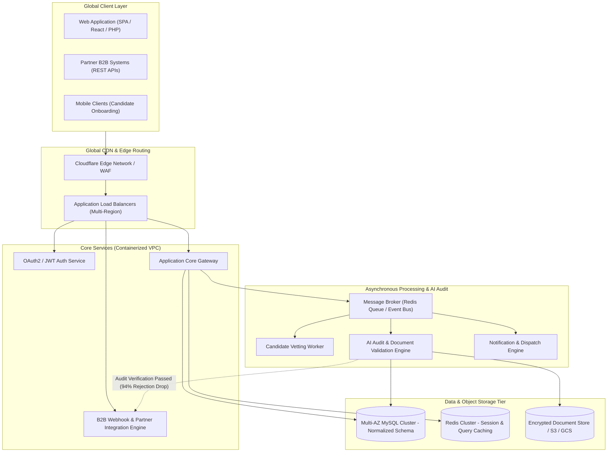
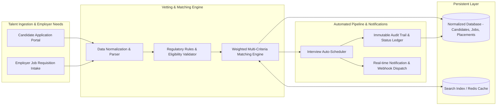
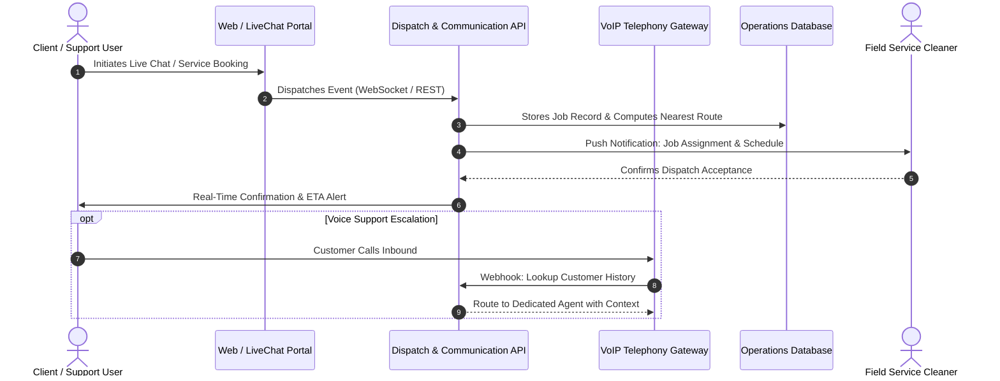
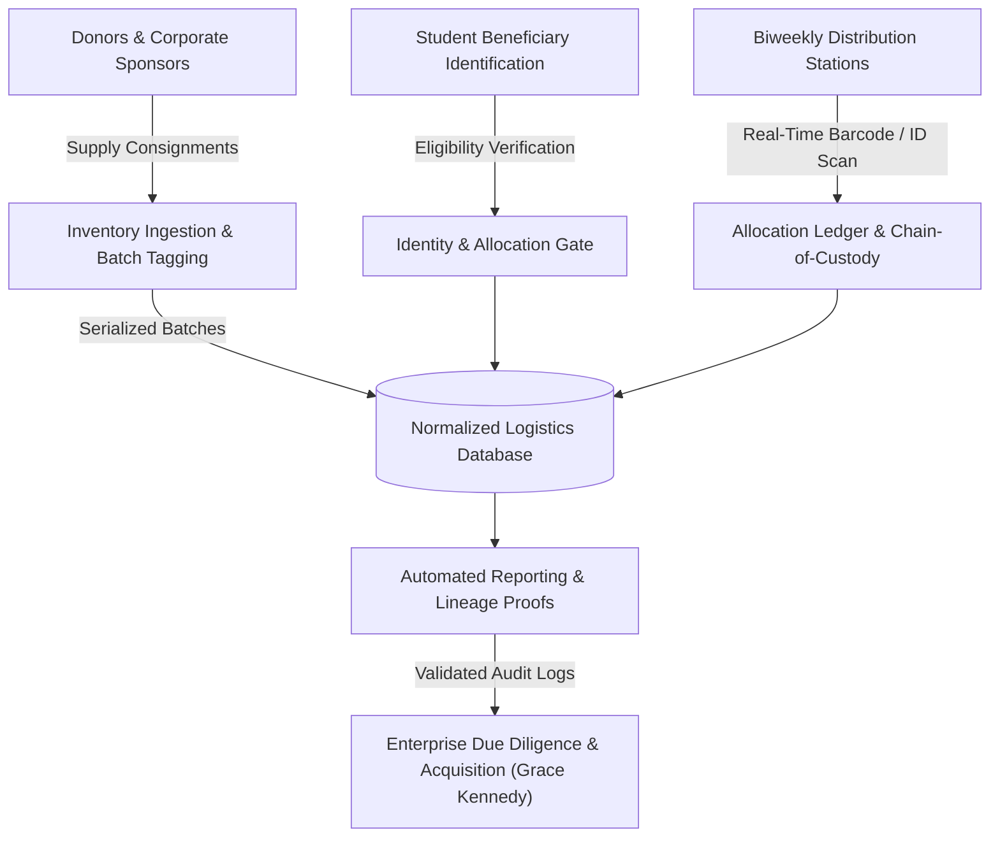

<div align="center">

# Norval Mendez | Systems Architecture & Engineering Portfolio

**Senior Software Developer & Lead Systems Architect**  
*Windsor, ON, Canada • [LinkedIn](https://www.linkedin.com/in/norval-mendez-369a2611a) • [Portfolio](https://norvalmendez.ca) • [Email](mailto:norvalmendez.ca@gmail.com)*

[](https://github.com/norval101)
[](https://www.linkedin.com/in/norval-mendez-369a2611a)
[](https://norvalmendez.ca)
[](https://github.com/norval101/portfolio-demos)
[](https://opensource.org/licenses/MIT)

<p align="center">
  <b>High-Availability Cloud Systems • RESTful Microservices & APIs • AI Automated Screening Pipelines • Enterprise Architecture</b>
</p>

---

</div>

## 📌 Executive Summary & Architecture Showcase

I am an award-winning **Senior Software Developer & Systems Architect** with 8+ years of engineering leadership, designing mission-critical SaaS platforms, cloud infrastructure (AWS/GCP), and distributed backend architectures.

Throughout my career, I have:
- **Architected high-availability systems for 8,000+ global users**, sustaining 99.9% uptime and powering 400% YoY enterprise revenue growth.
- **Pioneered automated AI vetting & audit pipelines**, slashing cross-border applicant rejection rates by **94%**.
- **Standardized partner REST integration specifications**, cutting B2B onboarding lead time by **87%** and operational latency by **85%**.
- **Built acquisition-ready platforms**, including the core distribution logistics system for *GK Campus Connect*, directly prompting enterprise acquisition by the **Grace Kennedy Group**.

---

## 🔒 Confidentiality & NDA Provenance Notice

> **Why are some production repositories private?**  
> Many of the platforms detailed below process proprietary enterprise data, cross-border workforce documents, commercial logistics, or client financial workflows protected under strict Non-Disclosure Agreements (NDAs).
>
> To respect client confidentiality while providing hiring managers and technical leadership with complete visibility into my architectural thinking, this repository provides:
> 1. **Production System Architecture Blueprints** (rendered via Mermaid.js directly in GitHub).
> 2. **Technical Specifications & Problem-Solving Deconstructions** (trade-offs, bottlenecks, data flow, security governance).
> 3. **Public Sandbox Code Implementations** (clean code patterns, unit test coverage, and API contracts demonstrating my coding standards).

---

## 🗺️ System Architecture Gallery

### 1. WATSOF — Global Cloud-Native Workforce SaaS & Automated AI Audit Engine
**Role:** Lead Technical Product Manager & Systems Architect (JELPO Group)  
**Scale:** 8,000+ Global Users | Multi-Region AWS & GCP | 99.9% SLA

#### Business Context & Challenge
The platform manages high-volume international exchange and workforce candidate processing. Manual vetting caused severe bottlenecks, documentation errors, high sponsor rejection rates, and cross-border latency issues across North America and the Caribbean.

#### Architectural Solution
- Architected a multi-region cloud topology leveraging AWS/GCP with Cloudflare edge caching, cutting global end-user latency by **85%**.
- Implemented an asynchronous event-driven document validation pipeline using AI pre-screening algorithms to detect anomalies, missing certifications, and compliance errors prior to sponsor submission.
- Standardized B2B webhook APIs, reducing enterprise partner onboarding from weeks to days (**87% reduction**).



#### Key Engineering Metrics & Outcomes
- **-94%** cross-border processing rejection rate via automated compliance vetting.
- **-85%** global end-user latency using multi-region edge distribution.
- **-87%** partner onboarding time using OpenAPI-standardized REST endpoints.
- **99.9%** availability maintained across 8,000+ active enterprise users.

---

### 2. LMIAPro — Candidate Vetting & Workforce Matching Engine
**Role:** Lead Systems Architect & Product Manager (LMIAPro — Calgary, AB)  
**Tech:** PHP, RESTful APIs, MySQL, Redis, Asynchronous Workers

#### Business Context & Challenge
Canadian employers faced prolonged recruitment cycles when seeking qualified international personnel under regulatory compliance constraints. Candidate tracking systems were fragmented, causing delayed vetting, mismatched qualifications, and manual interview coordination.

#### Architectural Solution
- Designed and built a bespoke candidate tracking CRM and algorithmic matching engine from scratch.
- Implemented a two-sided matching algorithm that maps employer role requirements (experience level, NOC classifications, skill tags) against candidate verification scores.
- Automated end-to-end recruitment pipelines including interview scheduling, status transitions, and compliance audit trail generation.



#### Key Engineering Metrics & Outcomes
- Automated candidate tracking workflows from entry to exit with zero data-entry duplication.
- Drastically accelerated employer-candidate matching times and interview scheduling.
- Implemented rigorous database constraints to ensure full regulatory auditability.

---

### 3. Real-Time Operations Dispatch & Field Communication Infrastructure
**Role:** Business Systems Support Specialist (Mango Maids — Calgary, AB)  
**Tech:** Real-time WebSockets, VoIP Systems, RESTful Dispatch API, MySQL

#### Business Context & Challenge
High-density field operations required responsive real-time dispatching, rapid cleaner scheduling, instant customer support resolution, and resilient VoIP communications to prevent missed appointments and operational bottlenecks.

#### Architectural Solution
- Built and integrated an automated operations engine for field cleaner scheduling and dispatch routing.
- Deployed a low-latency real-time live chat customer support pipeline to increase client engagement and response speed.
- Re-engineered VoIP routing topologies, resolving communication drops and unifying customer interaction channels into the internal management platform.



---

### 4. GK Campus Connect — Food Bank Distribution Logistics Platform
**Role:** Technical Co-Founder & Distribution Specialist  
**Acquisition:** Acquired by **Grace Kennedy Group**  
**Scale:** Biweekly food package delivery to 1,000+ university students

#### Business Context & Challenge
Legacy distribution relied on error-prone paper records and ad-hoc spreadsheets, causing inventory discrepancies, lack of traceability, and inability to report verified metrics to corporate sponsors.

#### Architectural Solution
- Directed the database schema normalization and domain modeling to transition manual distribution into a high-availability digital inventory and recipient management software.
- Authored UML specifications, data lineage mapping docs, and User Acceptance Testing (UAT) frameworks.
- Built an immutable custody-tracking distribution workflow that proved operational viability, winning corporate confidence and resulting in full enterprise acquisition by **Grace Kennedy Group**.



---

## 💻 Tech Stack & Technical Competencies

| Domain | Technologies & Frameworks |
| :--- | :--- |
| **Languages** | PHP, Python, JavaScript/TypeScript, Java, C#, C++, SQL, HTML5, CSS3, Flutter |
| **Backend & Architecture** | Systems Architecture, Microservices, RESTful APIs, OOP / SOLID, MVC, Webhooks, GraphQL |
| **Databases & Caching** | MySQL (Complex Joins, Index Optimization, Normalization), Redis, PostgreSQL |
| **Cloud & DevOps** | AWS (EC2, S3, RDS, CloudFront), Google Cloud Platform (GCP), Docker, CI/CD Pipelines, Git/GitHub |
| **Security & Auth** | OAuth 2.0, Auth0, JWT Authentication, RBAC (Role-Based Access Control), Data Privacy Governance |
| **Testing & Quality** | Unit Testing (PHPUnit, Jest, PyTest), Integration Testing, UAT Test Plans, Rigorous Code Review |
| **Modern Tooling** | Agentic AI Workflows (Cursor, Claude Code), Custom Python Diagnostics, Jira, Agile/Scrum |

---

## 🏆 Awards & Industry Honors

- 🥇 **Top Innovator of the Year (2024)** — *Ministry of Labour & Social Security (Jamaica)*
- 🏅 **DBJ IGNITE Innovation Award (2022)** — *Development Bank of Jamaica*
- 🏆 **Entrepreneurship & Innovation Award (2016)** — *University of the West Indies*
- 🎓 **UML & Software Design Certification (2022)** — *University of Alberta*
- 🔐 **Computer Network Systems & Security (2021)** — *University of Colorado*

---

## 📁 Functional Sandbox Demos (Included in this Repo)

To complement the architectural blueprints above, two fully tested, self-contained reference sandboxes are implemented directly within this repository:

### 1. [`demos/workforce-matching-engine/`](./demos/workforce-matching-engine)
- **Concept:** Production-grade two-sided candidate matching engine & regulatory eligibility gate (inspired by the LMIAPro architecture).
- **Features:** Clean OOP domain architecture, weighted scoring algorithm, tamper-evident SHA-256 chained audit ledger, built-in REST API server, and OpenAPI 3.0 specification.
- **Run Unit Tests:**
  ```bash
  python -m unittest discover -s demos/workforce-matching-engine/tests -t demos/workforce-matching-engine -p "test_*.py" -v
  ```

### 2. [`demos/document-audit-pipeline/`](./demos/document-audit-pipeline)
- **Concept:** Multi-stage automated document audit and risk scoring engine (inspired by the WATSOF compliance pipeline that reduced rejection rates by 94%).
- **Features:** Format & checksum verification, temporal validity & expiration boundary checking, token-based identity consistency matching, and regulatory compliance rules.
- **Run Unit Tests:**
  ```bash
  python -m unittest discover -s demos/document-audit-pipeline/tests -t demos/document-audit-pipeline -p "test_*.py" -v
  ```

---

## 🧪 Run All Repository Tests
```bash
# Run both test suites simultaneously from root (zero external dependencies required)
python -m unittest discover -s demos/workforce-matching-engine/tests -t demos/workforce-matching-engine -p "test_*.py"
python -m unittest discover -s demos/document-audit-pipeline/tests -t demos/document-audit-pipeline -p "test_*.py"
```

---

## 📬 Contact & Connect

- **Website:** [norvalmendez.ca](https://norvalmendez.ca)
- **LinkedIn:** [linkedin.com/in/norval-mendez-369a2611a](https://www.linkedin.com/in/norval-mendez-369a2611a)
- **Email:** [norvalmendez.ca@gmail.com](mailto:norvalmendez.ca@gmail.com) / [norval@digitalawah.com](mailto:norval@digitalawah.com)
- **Location:** Windsor, ON, Canada
